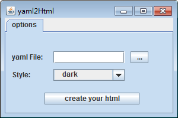

html生成器使用说明

=
1.安装
-
步骤如图：可以选择是否生成桌面快捷方式、开始菜单项等。

2.使用
-
安装完成后，打开可执行文件，会弹出下面的窗口：

点击yaml File后面的按钮，会弹出文件选择框，默认指向程序中附带的yml文件路径，也可以选择其它路径：

选择文件之后，yaml File后面的文本框内容会变化为所选文件路径。之后可以在style选单中选择主题风格：

设置好上面两项内容后，点击create your html按钮，将会自动生成html文件并且自动打开：

